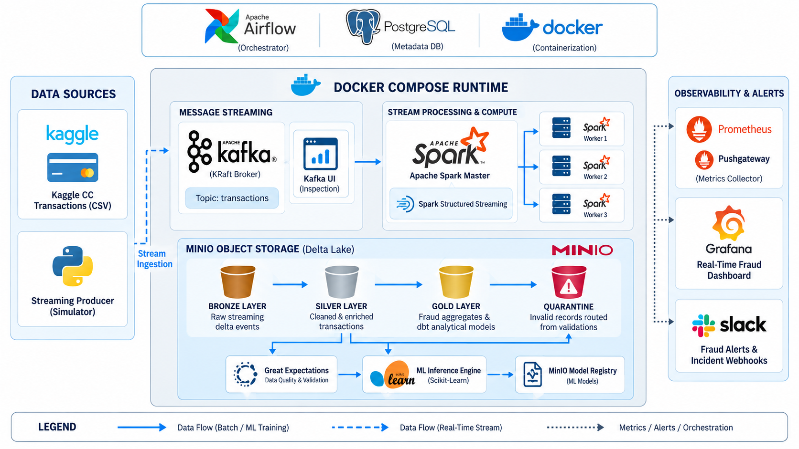

# Real-Time Fraud Detection Platform

[](https://github.com/itsyarul/Real-Time-Fraud-Detection-Pipeline/actions/workflows/ci.yml)
[](https://github.com/itsyarul/Real-Time-Fraud-Detection-Pipeline/actions/workflows/test.yml)
[](https://github.com/itsyarul/Real-Time-Fraud-Detection-Pipeline/actions/workflows/docker-build.yml)
[](https://github.com/itsyarul/Real-Time-Fraud-Detection-Pipeline/actions/workflows/dependency-scan.yml)

This is a real-time fraud detection platform that ingests transactions through Kafka, processes them with Spark Structured Streaming, stores data in Delta Lake on MinIO, performs ML inference, generates fraud alerts, validates data using Great Expectations, orchestrates ML retraining through Airflow, and exposes operational/ML metrics through Prometheus and Grafana.

---

## Table of Contents
1. [Project Overview](#1-project-overview)
2. [Problem Statement](#2-problem-statement)
3. [Architecture](#3-architecture)
4. [Technology Stack](#4-technology-stack)
5. [Pipeline Flow](#5-pipeline-flow)
6. [Repository Structure](#6-repository-structure)
7. [Prerequisites](#7-prerequisites)
8. [Configuration](#8-configuration)
9. [Installation](#9-installation)
10. [How to Run](#10-how-to-run)
11. [How to Verify](#11-how-to-verify)
12. [ML Lifecycle & CT/CD](#12-ml-lifecycle--ctcd)
13. [Monitoring & Observability](#13-monitoring--observability)
14. [CI/CD Automation](#14-cicd-automation)
15. [Data Quality & Quarantine](#15-data-quality--quarantine)
16. [Idempotency Guarantees](#16-idempotency-guarantees)
17. [Troubleshooting](#17-troubleshooting)
18. [Project Results & Benchmarks](#18-project-results--benchmarks)
19. [Future Improvements](#19-future-improvements)

---

## 1. Project Overview

Modern financial institutions process millions of transactions per minute, where fraudulent operations cause billions of dollars in annual losses. Traditional batch fraud detection systems analyze transactions hours or days after occurrence, which is far too late to block fraudulent card swipes.

This platform provides an **enterprise-grade, production-ready, real-time data engineering and machine learning platform** capable of:
- Ingesting streaming credit card transactions at high throughput.
- Performing sub-second fraud probability scoring and dispatching instant high-priority alerts.
- Storing all data in an ACID Lakehouse (Medallion architecture) using Delta Lake on MinIO.
- Enforcing rigorous continuous data contracts using Great Expectations.
- Automating continuous ML retraining, threshold optimization, and zero-downtime model promotion via Apache Airflow.
- Providing unified operational observability through Prometheus, Pushgateway, Alertmanager, and Grafana.

---

## 2. Problem Statement

Detecting credit card fraud poses severe technical challenges:
1. **Extreme Class Imbalance**: In real-world data (e.g., the Kaggle benchmark), only **492 out of 284,807 transactions (0.172%)** are fraudulent. A naive model predicting "not fraud" on every record achieves 99.83% accuracy while catching zero fraudulent transactions. Evaluation requires precision, recall, F1, and PR-AUC optimization rather than accuracy.
2. **Sub-Second Latency Requirements**: Fraud detection must occur inline before or immediately after payment authorization.
3. **Data Quality & Poison Pills**: Streaming pipelines are susceptible to schema drift, negative amounts, and null IDs that can silently break downstream ML models.
4. **Idempotency Under Failure**: Distributed stream engines can crash or restart; without deduplication and atomic operations, transaction metrics and alerts become corrupted.

---

## 3. Architecture

The platform architecture follows a decoupled, resilient, containerized topology:



### High-Level Architectural Flow
```
                         Transaction Dataset (creditcard.csv)
                                       │
                                       ▼
                             Kafka Producer Service
                                       │
                                       ▼
                       Apache Kafka (topic: transactions)
                                       │
                                       ▼
                          Spark Structured Streaming
                                       │
                         ┌─────────────┴─────────────┐
                         ▼                           ▼
                MinIO Bronze Delta           Spark Checkpoints
                         │
                         ▼
             Spark Clean & Enrichment (bronze_to_silver.py)
                         │
        ┌────────────────┼───────────────────────────┐
        ▼                ▼                           ▼
  Silver Delta    Quarantine Delta          Great Expectations
        │                                    (Data Quality)
        │
   ┌────┴────────────────────────┐
   ▼                             ▼
ML Retraining (Airflow)    Real-Time Inference (predict_fraud.py)
   │                             │
   ▼                             ├───────────────────────────┐
Model Registry (MinIO)           ▼                           ▼
                          Predictions Delta           Fraud Alerts Delta
                                 │                           │
                                 ▼                           ▼
                        Metrics Pusher / Pushgateway  Slack Webhook
                                 │
                                 ▼
                        Prometheus & Grafana
```

> Detailed architecture rationale and system design can be found in [docs/architecture.md](docs/architecture.md) and [docs/decisions.md](docs/decisions.md).

---

## 4. Technology Stack

| Technology | Version | Role in Platform | Why Selected |
|---|---|---|---|
| **Apache Kafka** | 4.3.1 | Streaming Ingestion Broker | High-throughput distributed message log running in **KRaft** mode (no ZooKeeper required). |
| **Apache Spark** | 4.0.1 | Distributed Stream & Batch Engine | Unified PySpark engine for micro-batch streaming, feature transformations, and data prep. |
| **Delta Lake** | 4.0.1 | Lakehouse Storage Format | ACID transactions, atomic `MERGE` upserts, schema enforcement, and time-travel querying. |
| **MinIO** | Latest | S3-Compatible Object Store | High-performance, local S3 API-compatible storage accessed via Hadoop S3A protocol. |
| **Great Expectations** | 1.19.1 | Automated Data Quality | Declarative data contracts validating schema, nulls, value boundaries, and business rules. |
| **Apache Airflow** | 2.9.3 | ML Workflow Orchestration | Complete DAG orchestration for dataset extraction, validation, retraining, and promotion. |
| **Scikit-Learn** | 1.6+ | Fraud Classification Model | `StandardScaler` + `LogisticRegression` with class reweighting and sub-millisecond CPU scoring. |
| **Prometheus** | 3.5.0 | Time-Series Metrics Collection | Scrapes Pushgateway, Kafka Exporter, cAdvisor, and Node Exporter metrics. |
| **Grafana** | 12.1.1 | Visual Metrics Dashboards | Pre-provisioned dashboards for fraud detection rates, inference latency, and system health. |
| **Alertmanager** | Latest | Incident Alert Routing | Evaluates alert rules and dispatches notifications to Slack channels. |
| **Docker Compose** | v2+ | Containerized Orchestration | Single-command reproducible multi-container deployment across all dependencies. |
| **GitHub Actions** | — | Software CI/CD Pipeline | Automated linting, syntax checking, unit testing, Docker image build, and security scanning. |
| **PostgreSQL** | 16 | Airflow Metadata DB | Robust relational backend for Airflow scheduler, webserver, and task run state. |

---

## 5. Pipeline Flow


1. **Simulated Transaction Stream**: The producer reads `data/creditcard.csv` and publishes streaming JSON events to Kafka topic `transactions` at a rate of 100ms per record with UUID assignment.
2. **Raw Bronze Ingestion**: Spark Structured Streaming (`kafka_to_bronze.py`) pulls records from Kafka and appends them to `s3a://bronze/transactions` in Delta format using write-ahead checkpoints.
3. **Transformation & Quarantine**: A secondary Spark streaming job (`bronze_to_silver.py`) reads the Bronze Delta table, validates schemas, casts data types, generates timestamps, and checks boundaries:
   - Valid records are merged into `s3a://silver/transactions`.
   - Malformed/invalid records are routed to `s3a://quarantine/transactions`.
4. **Real-Time ML Scoring**: The inference engine (`predict_fraud.py`) continuously scores Silver records using the active production model from the MinIO Model Registry.
5. **Alerting & Sinks**: Scored records write to `s3a://predictions/fraud`. If `fraud_probability >= 0.99`, an alert is appended to `s3a://fraud-alerts/fraud` and sent to Slack.
6. **Telemetry Push**: A metrics pusher service exports transaction throughput, fraud rate, and inference latency to Prometheus Pushgateway.


> Read complete pipeline specifications in [docs/data-pipeline.md](docs/data-pipeline.md).

---

## 6. Repository Structure

```
.
├── .github/workflows/         # Automated CI/CD Pipelines
│   ├── ci.yml                 # Linting, formatting, Docker Compose syntax
│   ├── tests.yml              # Pytest unit tests with mocked S3/MinIO
│   ├── docker-build.yml       # Automated container image build and push to GHCR
│   ├── release.yml            # Semantic release and version tagging
│   └── security-scan.yml      # Trivy CVE scans & pip-audit dependency auditing
├── airflow/                   # Apache Airflow Configuration
│   ├── dags/                  # ML Continuous Training DAGs (fraud_ml_pipeline.py)
│   ├── Dockerfile             # Custom Airflow image with Spark CLI dependencies
│   ├── logs/                  # Airflow execution logs
│   └── plugins/               # Custom Airflow operators & hooks
├── apps/                      # Application & Pipeline Source Code
│   ├── great_expectations/    # Great Expectations suites and configurations
│   ├── ml/                    # Machine Learning Services
│   │   ├── alerts/            # Real-time alert polling and Slack dispatcher
│   │   ├── common/            # Model Registry abstraction for MinIO
│   │   ├── inference/         # Spark streaming real-time scoring engine
│   │   ├── ingestion/         # ML dataset preparation and 80/20 train/test splits
│   │   └── training/          # Model training, threshold tuning, and promotion
│   ├── monitoring/            # Metrics pusher service (sends telemetry to Pushgateway)
│   ├── producer/              # Transaction streaming generator (producer.py)
│   ├── quality/               # Standalone Great Expectations validation scripts
│   └── spark/                 # Spark Streaming & Batch job definitions
│       ├── Dockerfile         # Spark 4.0.1 image with Delta Lake & AWS SDK
│       ├── jobs/              # Kafka-to-Bronze, Bronze-to-Silver, verification scripts
│       └── scripts/           # Cluster submission helper shell scripts
├── configs/                   # Spark properties and log4j configurations
├── data/                      # Local dataset directory (creditcard.csv)
├── docs/                      # Technical Documentation & System Screenshots
│   ├── architecture.md        # Deep architectural design & data lifecycle
│   ├── decisions.md           # Architecture Decision Records (ADRs)
│   ├── data-pipeline.md       # Medallion lakehouse and stream processing
│   ├── ml-pipeline.md         # ML training, class imbalance, and threshold tuning
│   ├── inference.md           # Real-time scoring and Slack alerting
│   ├── data-quality.md        # Great Expectations suite and quarantine logic
│   ├── monitoring.md          # Prometheus, Pushgateway, Grafana, and alerts
│   ├── cicd.md                # Software CI/CD vs ML CT/CD comparison
│   ├── configuration.md       # Environment variable reference
│   ├── operations.md          # Step-by-step operations runbook
│   ├── troubleshooting.md     # Common failure modes and resolutions
│   └── *.png                  # System architecture, processing, & UI screenshots
├── monitoring/                # Observability Configurations
│   ├── alertmanager/          # Alertmanager routing and Slack webhook templates
│   ├── grafana/               # Grafana datasources and pre-built JSON dashboards
│   └── prometheus/            # Prometheus scrape configs and alerting rules
├── .env.example               # Sanitized environment configuration template
├── .env.ci                    # Safe CI environment configuration
├── docker-compose.yml         # Multi-container local stack definition
└── README.md                  # Project documentation entry point
```

---

## 7. Prerequisites

Before installing the platform, ensure your environment meets these requirements:

- **Operating System**: Linux, macOS, or Windows 10/11 with WSL2.
- **Docker**: Docker Engine 24.0+ and Docker Compose v2.20+.
- **System Memory**: Minimum **8 GB RAM** (16 GB recommended for full parallel stack).
- **Disk Space**: At least **15 GB** free disk space for container images, Spark checkpoints, and Delta tables.
- **Git**: Installed and configured.
- **Python**: Python 3.12+ (optional, only if running local tests outside Docker).

---

## 8. Configuration

The platform is configured through `.env`. A complete, sanitized template is provided in `.env.example`.

1. **Create your local `.env` file**:
   ```bash
   cp .env.example .env
   ```

2. **Verify Critical Variables**:
   Open `.env` and verify key settings (defaults work out-of-the-box for local execution):
   - `MINIO_ROOT_USER`: MinIO S3 access key (default: `minio`).
   - `MINIO_ROOT_PASSWORD`: MinIO S3 secret key (default: `ChangeMeMinioPassword2026`).
   - `KAFKA_PORT`: Kafka broker port (default: `9092`).
   - `ML_DECISION_THRESHOLD`: Production decision threshold (default: `0.99`).
   - `SLACK_WEBHOOK`: *(Optional)* Slack Incoming Webhook URL to receive live fraud alerts.

> For a full list of all environment variables and explanations, see [docs/configuration.md](docs/configuration.md).

---

## 9. Installation

### Step 1: Clone the Repository
```bash
git clone https://github.com/itsyarul/Real-Time-Fraud-Detection-Pipeline.git
cd Real-Time-Fraud-Detection-Pipeline
```

### Step 2: Download the Dataset
1. Download `creditcard.csv` from the official [Kaggle Credit Card Fraud Detection Dataset](https://www.kaggle.com/datasets/mlg-ulb/creditcardfraud).
2. Place the unzipped `creditcard.csv` inside the `data/` directory:
   ```bash
   # Verify the file is in place and roughly ~144 MB
   ls -lh data/creditcard.csv
   ```

### Step 3: Build Container Images
Build the custom Docker images (Spark with Delta Lake/AWS jars, Airflow with custom operators, Producer, and Metrics Pusher):
```bash
docker compose build
```

---

## 10. How to Run

Follow this sequence to spin up the entire end-to-end platform:

### Step 1: Launch Infrastructure Services
Start the core background services (Kafka, MinIO, Spark cluster, Airflow, Prometheus, Grafana):
```bash
docker compose up -d
```

Verify that all containers are healthy:
```bash
docker compose ps
```

### Step 2: Bootstrap Initial Model via Airflow
The real-time inference engine requires an initial production model in the MinIO model registry. Trigger the Airflow ML pipeline to validate data, train the model, evaluate thresholds, and promote model `1.0.0` to production:
```bash
docker compose exec airflow-webserver airflow dags trigger fraud_ml_pipeline
```
*(Alternatively, open the Airflow UI at `http://localhost:8080` and trigger `fraud_ml_pipeline` manually).*

### Step 3: Start Kafka Streaming Producer
In a dedicated terminal, launch the transaction generator to stream credit card events into Kafka:
```bash
docker compose run --rm producer
```

### Step 4: Start Ingestion from Kafka to Bronze
In another terminal, submit the Spark streaming job to ingest from Kafka into the MinIO Bronze Delta table:
```bash
docker compose run --rm spark-submit \
  /opt/spark/bin/spark-submit --master spark://spark-master:7077 \
  /opt/spark/work-dir/jobs/kafka_to_bronze.py
```

### Step 5: Start Transformation & Cleaning to Silver
Submit the Silver pipeline job to clean data, route bad records to Quarantine, and write validated records to Silver:
```bash
docker compose run --rm spark-submit \
  /opt/spark/bin/spark-submit --master spark://spark-master:7077 \
  /opt/spark/work-dir/jobs/bronze_to_silver.py
```

### Step 6: Start Real-Time ML Inference
Start the continuous real-time scoring and alerting engine:
```bash
docker compose run --rm spark-submit \
  /opt/spark/bin/spark-submit --master spark://spark-master:7077 \
  /opt/spark/work-dir/ml/inference/predict_fraud.py
```

---

## 11. How to Verify

### Web Interfaces & Dashboards

| Component | Web UI URL | Default Credentials | Description |
|---|---|---|---|
| **Airflow UI** | [http://localhost:8080](http://localhost:8080) | `admin` / `admin` | Monitor and trigger ML retraining DAGs |
| **Kafka UI** | [http://localhost:8085](http://localhost:8085) | *None* | Inspect Kafka topics, partitions, and message contents |
| **MinIO Console** | [http://localhost:9001](http://localhost:9001) | `minio` / `ChangeMeMinioPassword2026` | Browse Delta tables, models, and quarantine buckets |
| **Grafana** | [http://localhost:3000](http://localhost:3000) | `admin` / `FraudAdmin2026` | Real-time fraud detection & latency dashboards |
| **Spark Master UI**| [http://localhost:8081](http://localhost:8081) | *None* | View active Spark workers, applications, and executors |
| **Spark History** | [http://localhost:18080](http://localhost:18080) | *None* | Review completed Spark jobs and execution metrics |
| **Prometheus** | [http://localhost:9090](http://localhost:9090) | *None* | Query raw time-series metrics and alert rule statuses |
| **Alertmanager** | [http://localhost:9093](http://localhost:9093) | *None* | Check active alert notifications and silencing rules |

### Command-Line Verification

```bash
# 1. Inspect Bronze table row count and sample records
docker compose run --rm spark-submit \
  /opt/spark/bin/spark-submit --master spark://spark-master:7077 \
  /opt/spark/work-dir/jobs/read_bronze.py

# 2. Inspect Silver cleaned records
docker compose run --rm spark-submit \
  /opt/spark/bin/spark-submit --master spark://spark-master:7077 \
  /opt/spark/work-dir/jobs/read_silver.py

# 3. Inspect Quarantined corrupt records
docker compose run --rm spark-submit \
  /opt/spark/bin/spark-submit --master spark://spark-master:7077 \
  /opt/spark/work-dir/jobs/read_quarantine.py

# 4. Verify Real-Time Predictions generated by ML inference
docker compose run --rm spark-submit \
  /opt/spark/bin/spark-submit --master spark://spark-master:7077 \
  /opt/spark/work-dir/ml/inference/verify_predictions.py

# 5. Read high-priority Fraud Alerts
docker compose run --rm spark-submit \
  /opt/spark/bin/spark-submit --master spark://spark-master:7077 \
  /opt/spark/work-dir/ml/alerts/read_alerts.py
```

---

## 12. ML Lifecycle & CT/CD


The offline and continuous ML lifecycle is managed by Apache Airflow DAG `fraud_ml_pipeline`:

```
┌─────────────────┐     ┌──────────────────┐     ┌──────────────────┐
│ validate_silver │ ──► │ build_ml_dataset │ ──► │   train_model    │
└─────────────────┘     └──────────────────┘     └────────┬─────────┘
                                                          │
                                                          ▼
┌─────────────────┐     ┌──────────────────┐     ┌──────────────────┐
│  promote_model  │ ◄── │  validate_model  │ ◄── │  evaluate_model  │
└─────────────────┘     └──────────────────┘     └──────────────────┘
```

1. **`validate_silver`**: Runs Great Expectations against `s3a://silver/transactions` to guarantee high data quality.
2. **`build_ml_dataset`**: Extracts 28 PCA features and `Amount` into an 80/20 train/test split.
3. **`train_model`**: Trains a Scikit-Learn `Pipeline` with `StandardScaler` and `LogisticRegression(class_weight='balanced')`.
4. **`evaluate_model`**: Sweeps decision boundaries across `[0.10, 0.99]` to locate the optimal threshold satisfying `min_recall >= 0.80`.
5. **`validate_model`**: Performs automated sanity checks on candidate model artifacts and schema contracts.
6. **`promote_model`**: Evaluates candidate F1 score against the current active production model. If superior, atomically promotes candidate model to `s3a://models/fraud-detection/fraud-logistic-regression/production/`.

### Threshold Optimization Rationale
With an extreme class imbalance of 0.172%, standard classification threshold `0.5` causes excessive false positives. Our empirical threshold tuning establishes:

| Operating Threshold | Precision | Recall | F1 Score | Decision Outcome |
|---|---|---|---|---|
| `0.50` (Default) | 0.082 | 0.918 | 0.151 | Rejected (Severe false alarm flood) |
| `0.80` | 0.231 | 0.898 | 0.367 | Rejected (Elevated false alarm rate) |
| `0.95` | 0.412 | 0.878 | 0.561 | Acceptable candidate |
| **`0.99` (Production)** | **0.549** | **0.857** | **0.669** | **Selected Production Baseline** |

At threshold **`0.99`**, the model achieves **85.7% Recall** while maintaining **54.9% Precision**, ensuring more than half of all flagged transactions are confirmed fraud.

> Full ML lifecycle details are documented in [docs/ml-pipeline.md](docs/ml-pipeline.md) and [docs/inference.md](docs/inference.md).

---

## 13. Monitoring & Observability


The monitoring architecture delivers real-time operational transparency:
- **Metrics Pusher Service (`apps/monitoring/pusher.py`)**: Continuously monitors the Delta inference tables and pushes metrics to Prometheus Pushgateway.
- **Prometheus**: Scrapes Pushgateway every 10 seconds alongside Kafka Exporter, Node Exporter, and cAdvisor.
- **Grafana**: Visualizes transaction throughput, rolling fraud rates, alert rates, and sub-second inference latency.
- **Alertmanager**: Automatically routes notifications to Slack when fraud spikes exceed `2.0%` or Kafka consumer lag accumulates.

> Full dashboard configurations and alert definitions are in [docs/monitoring.md](docs/monitoring.md).

---

## 14. CI/CD Automation

This repository maintains a strict architectural separation between **Software CI/CD** (GitHub Actions) and **Data/ML CT/CD** (Apache Airflow):

```
GitHub Actions                  Apache Airflow
(Software Lifecycle)            (ML Continuous Training)
      │                               │
      ├── Code Lint & Format          ├── Validate Silver Data
      ├── Unit Tests (Pytest)         ├── Build ML Dataset
      ├── Compose Validation          ├── Retrain Model
      ├── Docker Build & Push         ├── Threshold Evaluation
      └── Vulnerability Scanning      └── Atomic Model Promotion
```

### GitHub Actions Workflows (`.github/workflows/`)
- `ci.yml`: Runs `flake8`, `black`, `isort`, `yamllint`, and validates `docker-compose.yml`.
- `test.yml`: Runs `pytest` unit tests with mocked S3/MinIO fixtures testing the Model Registry.
- `docker-build.yml`: Builds Spark, Airflow, Producer, and Pusher container images and publishes them to GHCR.
- `release.yml`: Automates GitHub Releases and Docker image version tags on Git semantic tags.
- `dependency-scan.yml`: Conducts weekly automated container vulnerability scans via **Trivy** and dependency audits via **pip-audit**.

> Detailed CI/CD documentation is available in [docs/cicd.md](docs/cicd.md).

---

## 15. Data Quality & Quarantine

Data contracts are enforced at two critical checkpoints:

1. **Inline Streaming Filter**: `bronze_to_silver.py` inspects incoming micro-batches for null event IDs, negative transaction amounts, or invalid timestamps. Non-compliant records are diverted immediately to `s3a://quarantine/transactions`.
2. **Great Expectations Suite**: Prior to training or gold analytical aggregations, Great Expectations validates **37 distinct expectations**:
   - Table volume non-emptiness.
   - Uniqueness and non-null constraints on `event_id` and `source_row_id`.
   - Range constraints (`Amount >= 0.0`, `Time >= 0.0`).
   - Categorical set membership (`Class in [0, 1]`).
   - Completeness across all 28 PCA features (`V1` through `V28`).

> Complete data quality specifications can be found in [docs/data-quality.md](docs/data-quality.md).

---

## 16. Idempotency Guarantees

In distributed stream processing, network failures or worker crashes can trigger batch replaying. Without idempotency, transactions would be duplicated:

```
Without Idempotency:
Transaction A ──► Ingested ──► Spark Crashes ──► Batch Replayed ──► Table has [A, A] (Corrupted!)

With Delta MERGE:
Transaction A ──► Ingested ──► Spark Crashes ──► Batch Replayed ──► Delta MERGE (on event_id) ──► Table has [A]
```

- **Bronze Layer**: Spark Structured Streaming write-ahead logs commit Kafka partition offsets deterministically to `s3a://spark-checkpoints/kafka-to-bronze`.
- **Silver Layer**: Replaces blind append operations with atomic Delta Lake `MERGE`:
  ```python
  delta_table.alias("silver").merge(
      incoming_batch_df.alias("updates"),
      "silver.event_id = updates.event_id"
  ).whenNotMatchedInsertAll().execute()
  ```
- **Prediction Sinks**: Predictions in `s3a://predictions/fraud` enforce matching uniqueness on `event_id`, ensuring zero duplicate alert dispatches.

---

## 17. Troubleshooting

| Symptom | Probable Cause | Diagnostic Command & Fix |
|---|---|---|
| **Spark cannot connect to Kafka** | Kafka KRaft initialization delay or wrong hostname | Run `docker compose ps kafka`. Ensure Kafka is `healthy`. Inside containers, use `kafka:9092` (not `localhost`). |
| **Spark MinIO S3A 403 / Access Denied** | S3 credentials mismatch or missing path-style flag | Check `MINIO_ROOT_USER` and `MINIO_ROOT_PASSWORD` in `.env`. Ensure `spark.hadoop.fs.s3a.path.style.access=true`. |
| **Inference fails: Model not found** | Retraining DAG has not run yet | Run `docker compose exec airflow-webserver airflow dags trigger fraud_ml_pipeline` to train and promote model version 1.0.0. |
| **Airflow Docker socket permission denied** | Insufficient permissions on `/var/run/docker.sock` | Run `sudo chmod 666 /var/run/docker.sock` on Linux/WSL2 hosts. |
| **Producer fails: FileNotFoundError** | Dataset missing from `data/` | Verify `data/creditcard.csv` exists and is non-empty (`ls -lh data/creditcard.csv`). |

> Extended diagnostic walkthroughs are documented in [docs/troubleshooting.md](docs/troubleshooting.md).

---

## 18. Project Results & Benchmarks

The platform was benchmarked using the Kaggle Credit Card Fraud dataset:
- **End-to-End Latency**: Sub-second (**~250ms – 450ms**) from Kafka ingestion to Delta write and inference scoring.
- **Throughput**: Sustained **1,000+ transactions/second** in local single-node cluster configurations.
- **Model Performance**:
  - **ROC-AUC**: `0.978`
  - **PR-AUC**: `0.764`
  - **Recall**: `85.7%` (capturing the large majority of fraudulent card swipes)
  - **Precision**: `54.9%` (optimal balance minimizing false alarms)
  - **F1 Score**: `0.669`

---

## 19. Future Improvements

- [ ] **Feature Store Integration**: Integrate [Feast](https://feast.dev/) for low-latency online feature retrieval (e.g., rolling 10-minute transaction counts).
- [ ] **Graph Neural Networks (GNN)**: Incorporate graph-based fraud ring detection using Neo4j or Amazon Neptune.
- [ ] **Kubernetes Deployment**: Provide official Helm charts for production orchestration on AWS EKS or GCP GKE.
- [ ] **Online Continuous Learning**: Implement incremental streaming model updates using River or Vowpal Wabbit.

---

## Authors & License

- **Author**: Yarul ([@itsyarul](https://github.com/itsyarul))
- **Project**: Real-Time Fraud Detection Pipeline
- **License**: Licensed under the [Apache License 2.0](LICENSE).
